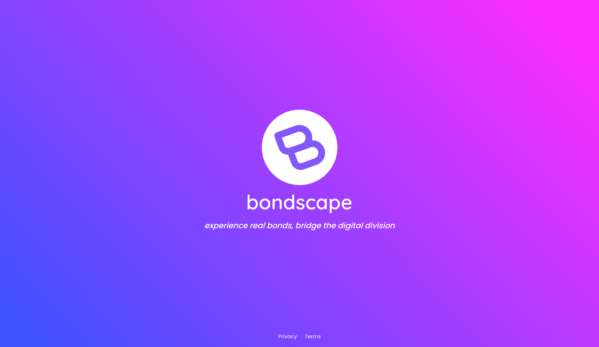

# Bondscape Website



## Development

### Requirements

This website is developed and published using [Firebase Hosting]().

To properly test everything locally you need to have the Firebase CLI installed on your machine.
If you don't, you can install it using the following:

```
npm install -g firebase-tools
```

### Local testing

To test this website on your local machine, just run the following command:

```
firebase emulators:start --only hosting
```